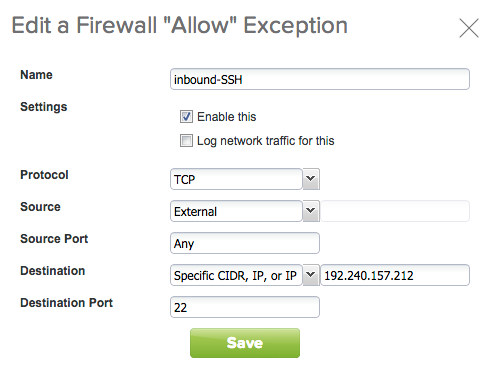

In this post I will describe how to run containers on <a href="http://vcloud.vmware.com">VMware vCloud Air</a>. I will use the Ubuntu template available in the catalog. Since the base image needs additional packages, it is important to make sure the new virtual machine has Internet access. 

The first step is to configure the routed network to use the edge gateway as the DNS server. On the Networks tab, click the "Manage in vCloud Director" button to open vCloud Director.

Then select the routed network and the "Properties" menu item.

Make sure the "Use gateway DNS" box is checked.

The next step is to create a new virtual machine based on the Ubuntu template. We can go back to the initial portal, on the "Virtual Machines" tab, click on the "Add One" button. Click on the "64 Bit" button at the "Ubuntu 12.04 AMD64" line.

On the next dialog, provide a name for the virtual machine and for the guest OS. Make sure the virtual machine is connected to the default routed network.

Once the virtual machine is created, you can power it on. On the "Networks" tab, the IP of the machine is displayed. Take note of the assigned IP address, we will use it to configure the edge gateway to enable Internet traffic.

On the "Gateways" tab, select the default gateway and the "NAT Rules" tab. Add SNAT and DNAT rules as shown below.

The SNAT rule enables oubound traffic from any machine in the routed network, the DNAT rule enables inbound traffic to port 22 to be translated to the new virtual machine on port 22 (SSH).

The last step is to configure the firewall to allow outbound traffic from any machine in the routed network ...

... and inbound traffic to port 22. Note the destination IP is one the public IPs assigned to the virtual Data Center, not the one assigned to the new virtual machine.

You can now go back to the virtual machine and click on "Launch Console". Log in as "root" using the password generated (displayed on the virtual machine details). You will need to change the password on the first login.

The machine should be able to connect to the Internet, use the following command to test:

    # ping -c 3 google.com

I prefer to SSH into the machine, instead of using the web console. For security reasons, the virtual machine is configured to deny password based SSH. To enable it, run the following commands:

    # sed -i 's/PasswordAuthentication no/PasswordAuthentication yes/' \
        /etc/ssh/sshd_config
    # service ssh restart

The machine is now ready for remote SSH access. From your local machine, SSH to the new virtual machine (use the public IP assigned to your virtual Data Center).

    $ ssh root@192.240.157.212

We are going to install the Docker container packages. Below are the relevant commands, more information can be found on the Docker <a href="http://docs.docker.com/installation/ubuntulinux/#ubuntu-precise-1204-lts-64-bit">site</a>.

    # apt-get update
    # curl -sSL https://get.docker.com/ubuntu/ | sudo sh

Docker is now installed on the machine. Let's verify that the installation has worked by downloading the "ubuntu" image and launching a container.

    # docker run -i -t ubuntu /bin/bash
    Unable to find image 'ubuntu' locally
    ubuntu:latest: The image you are pulling has been verified
    511136ea3c5a: Pull complete 
    d497ad3926c8: Pull complete 
    ccb62158e970: Pull complete 
    e791be0477f2: Pull complete 
    3680052c0f5c: Pull complete 
    22093c35d77b: Pull complete 
    5506de2b643b: Pull complete 
    Status: Downloaded newer image for ubuntu:latest

Type "exit" to exit. The virtual machine on vCloud Air is now ready to run containers.

